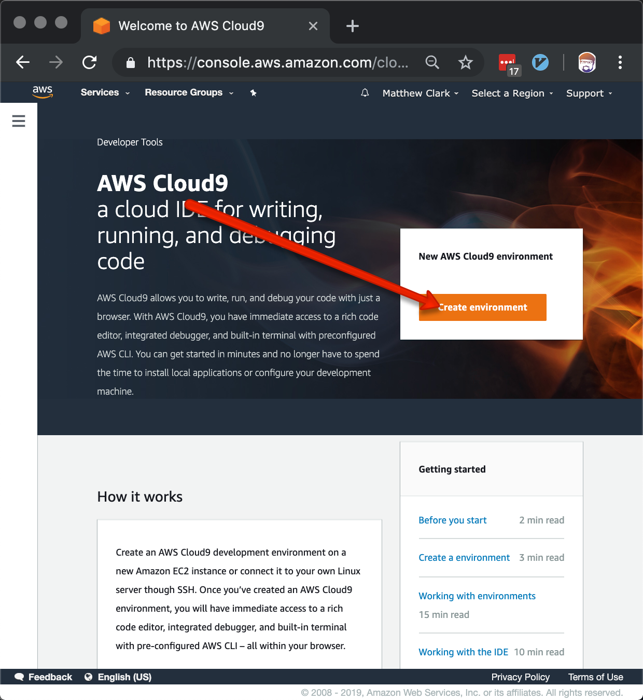
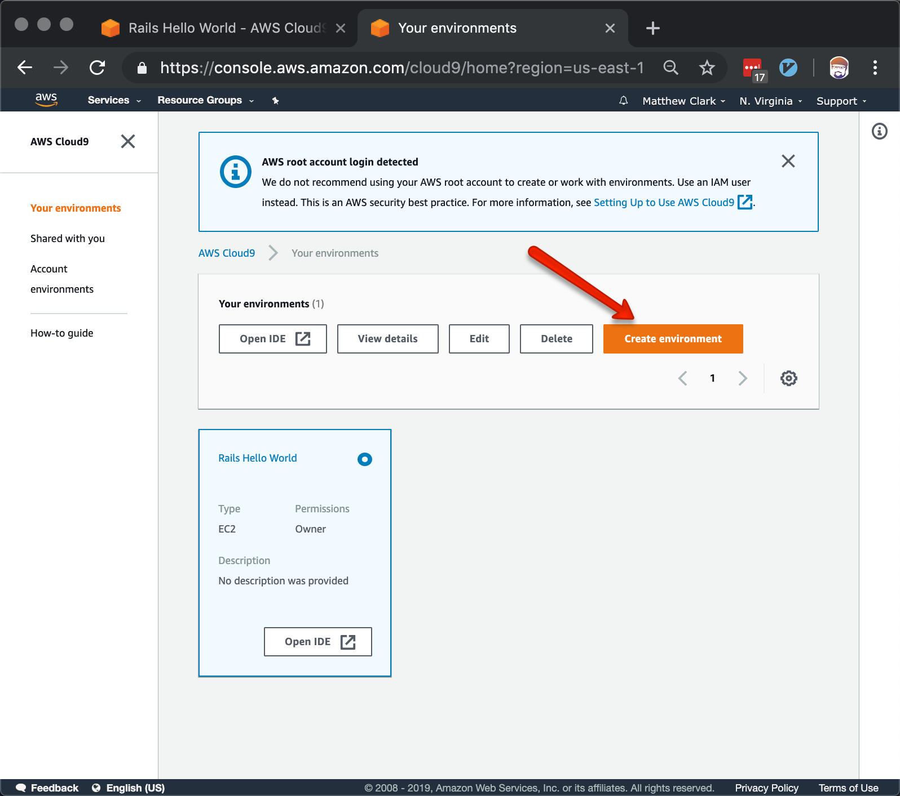
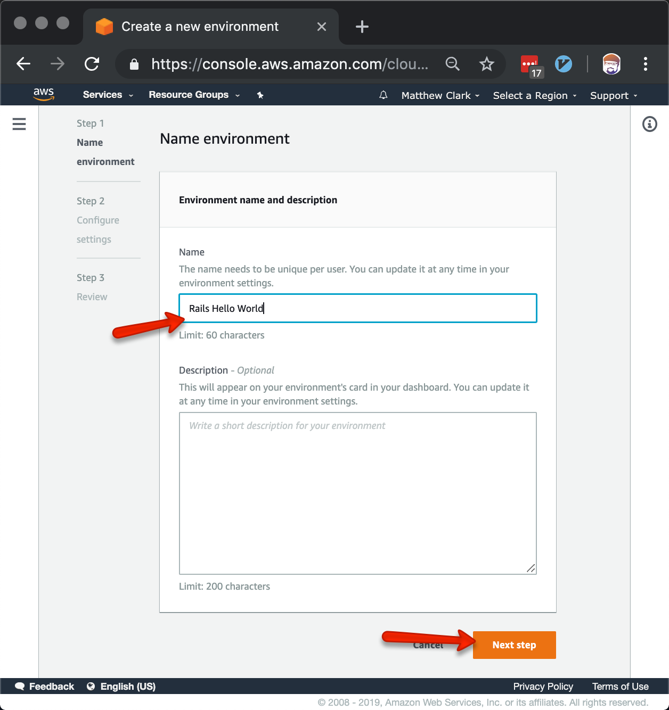
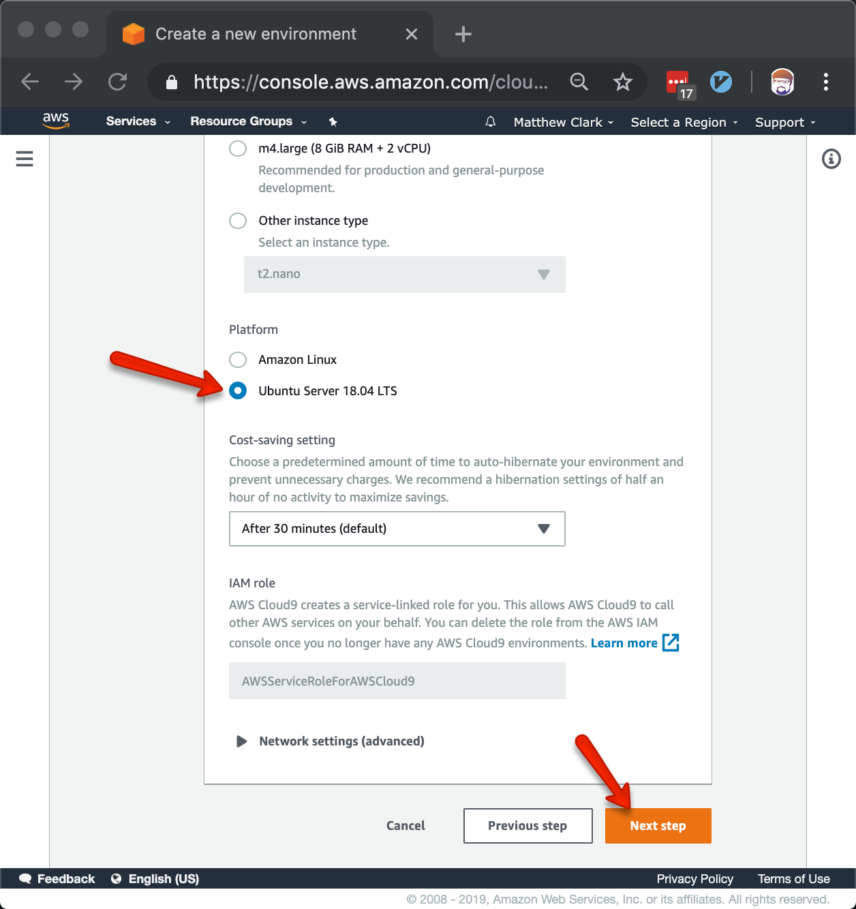
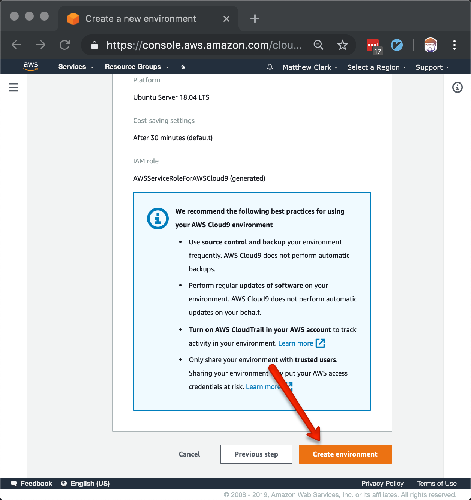
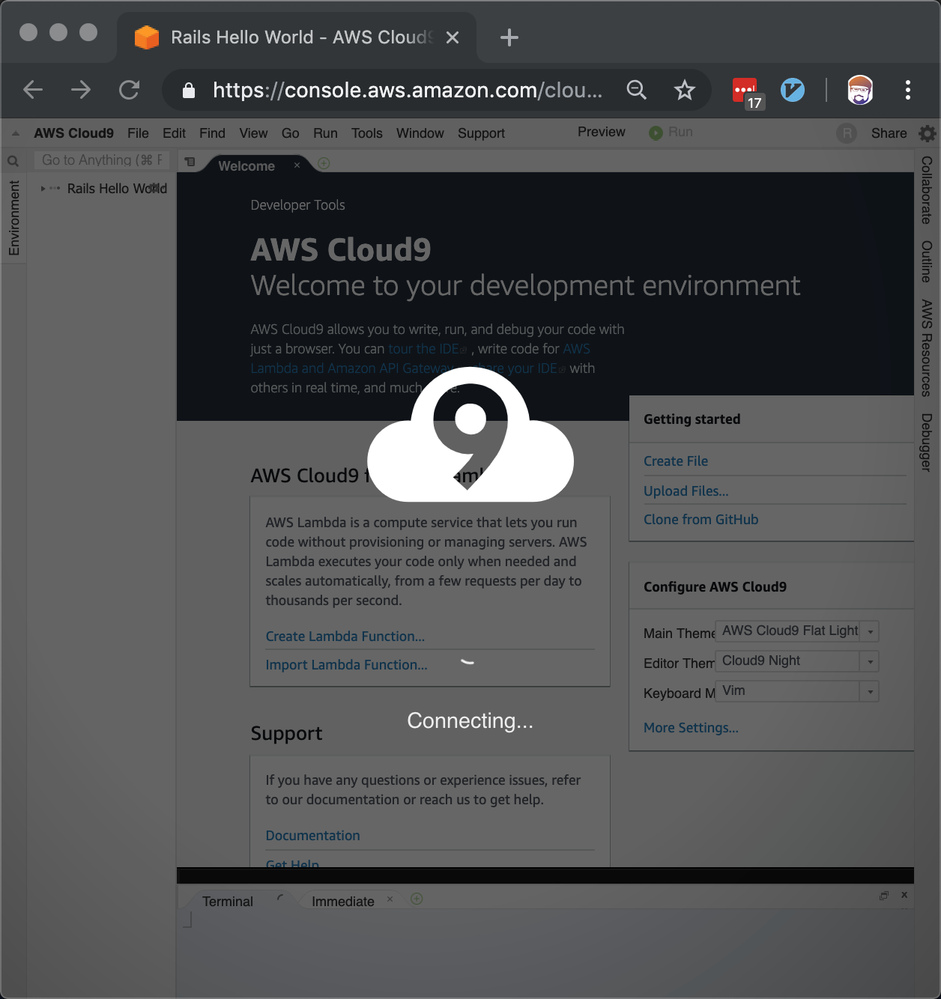
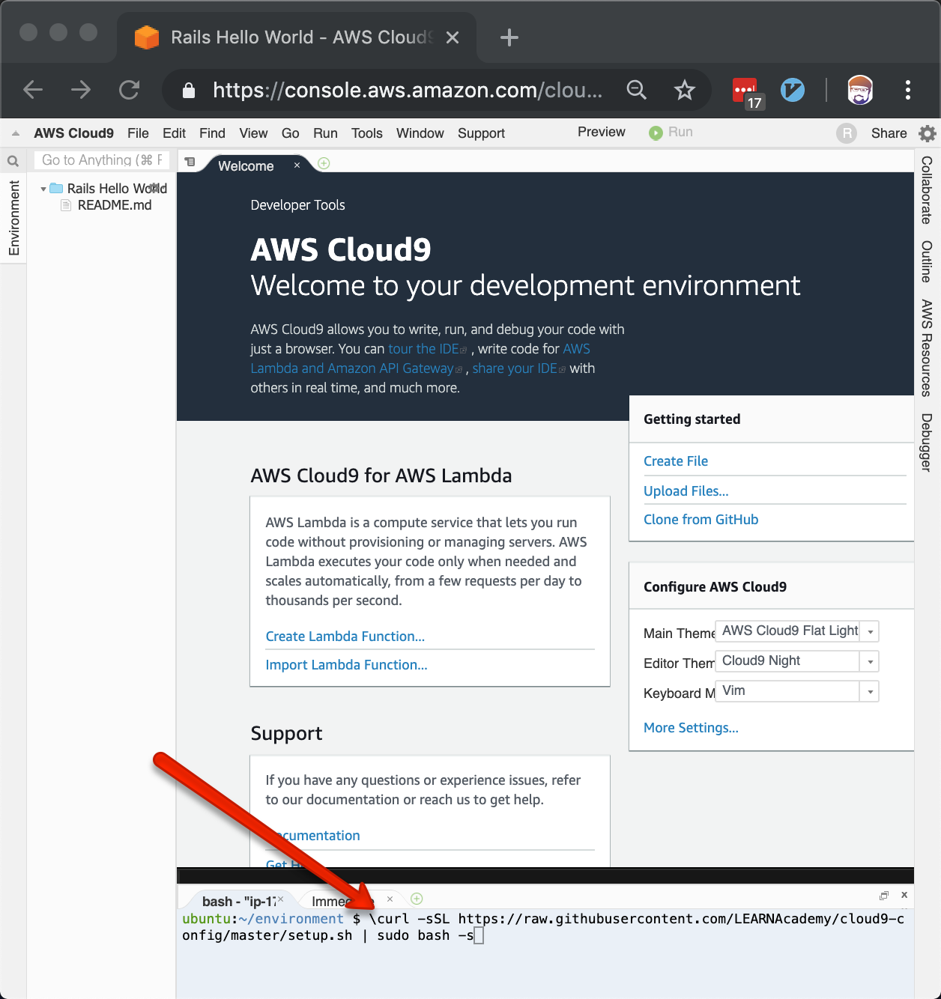
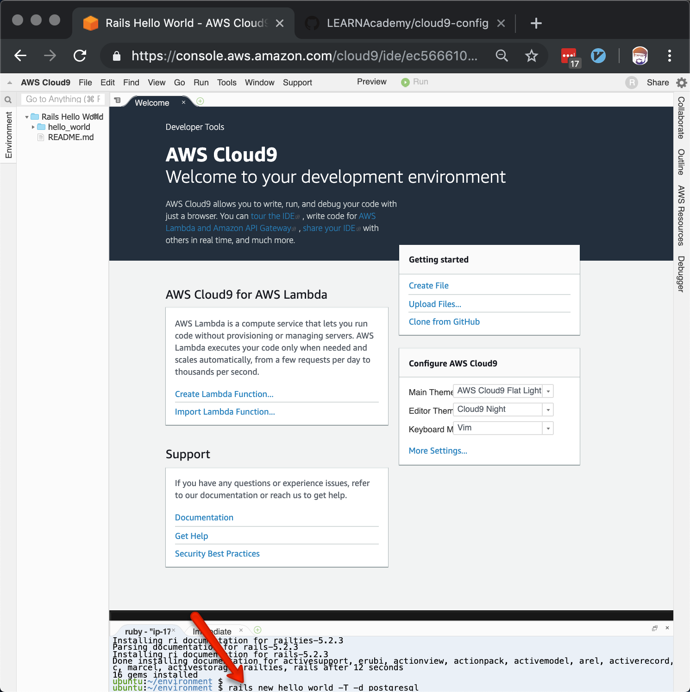
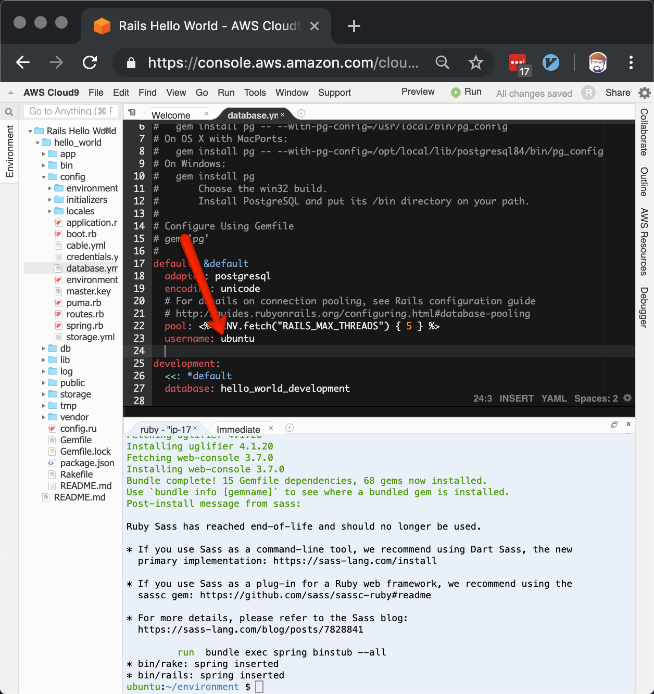
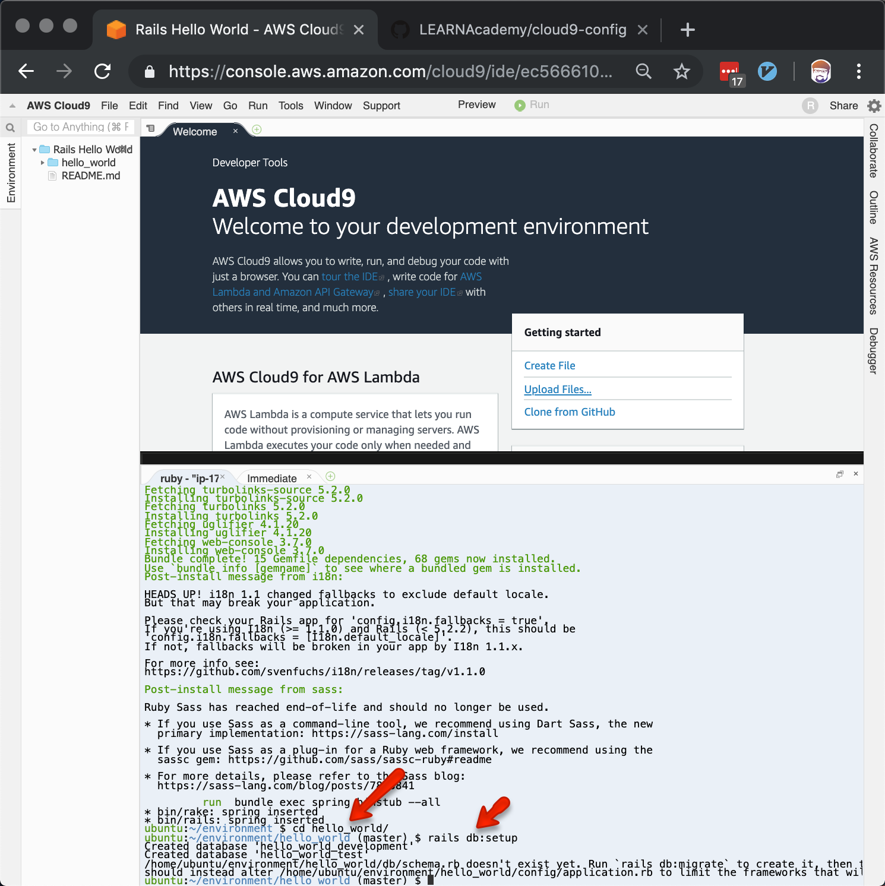

# cloud9-config

[](https://www.youtube.com/watch?v=w9lT4Sz5tNs)
]

## setup.sh

This is a script to run on a new Cloud-9 Ubuntu instance that will setup a Ruby on Rails environment for development.

### Quickstart

1) Choose 'Ubuntu' environment when setting up a new Cloud 9 Instance
2) From the command line, run:
  ```\curl -sSL https://raw.githubusercontent.com/LEARNAcademy/cloud9-config/master/setup.sh | sudo bash -s```
3) Set the username in config/database.yml to: ubuntu

### Details

#### Create a new environment


Or, if you have created another environment alredy, you can start here:



#### Choose a Name
Name your environment something descriptive.  You'll likely end up with many environments, so name it something that will help you remember exactly what work is on this environment.



#### Choose Ubuntu
Ubuntu is a flavor of Linux that is great for developing and deploying all kinds of web applications.  Javascript, Node, and Rails especially!



#### Review



#### Connecting
It may take a minute or two for Cloud9 to setup your new development server.  This is a great time to refresh your coffee.



#### Run Setup
Copy and past the following command into the terminal window.  This will download a script from Learn's Github account and configure your sever with the things you need to start developing:

```Bash
 \curl -sSL https://raw.githubusercontent.com/LEARNAcademy/cloud9-config/master/setup.sh | sudo bash -s
 ```

 

 #### Create a Rails App
 You're ready to create your application

 


 #### Set Ubuntu Postgres User
 The setup script created a user in Postgresql named 'ubuntu'.  We need to configure Rails to use this user when connecting to the database.

 

 ### Create the Database
 You can now create the database for your project.

 
